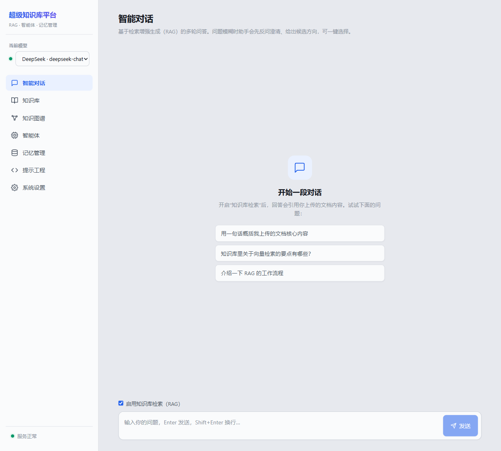
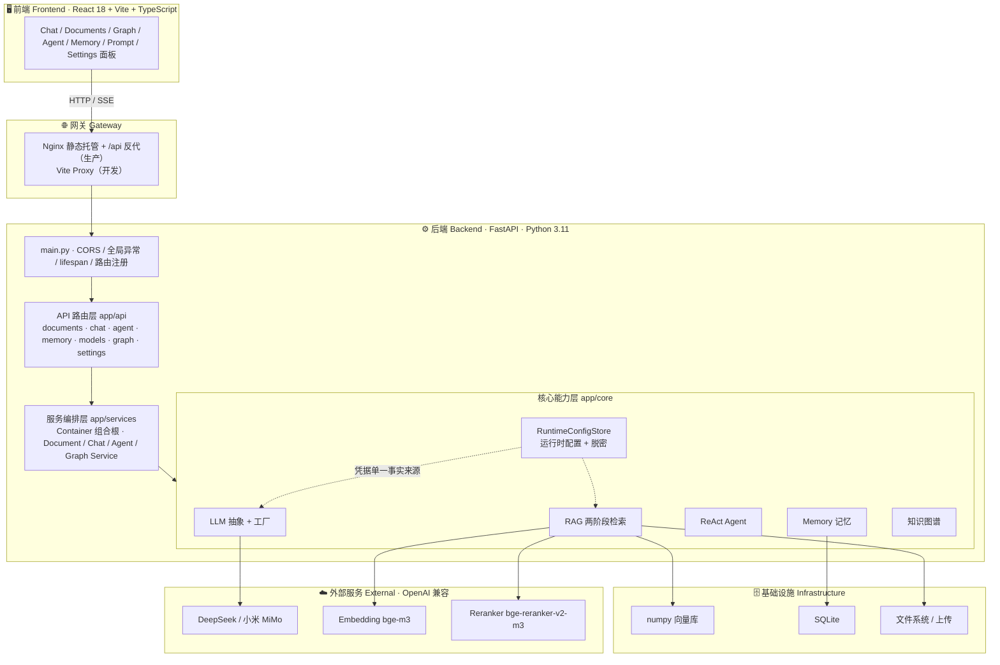

# 🧩 AI 知识库平台 · AI Knowledge Base Platform

<p><b>简体中文</b>　｜　<a href="#-english-introduction">English</a></p>

> **一句话**：独立设计并实现的**生产级 AI 知识库平台**，打通 **RAG（真实语义嵌入 + 两阶段重排序）、ReAct 智能体、多模型 LLM、上下文记忆、知识图谱** 五大能力；支持在 **Web 端接入 / 切换大模型密钥并脱密保护**，前后端分离 + 分层架构，Docker 一键部署。

本项目覆盖现代 AI 产品「文档摄取 → 向量检索 → 提示工程 → 智能体编排 → 多轮记忆 → 知识图谱 → 前端交互」的完整链路，是一个可运行、可测试、可扩展的工程作品集。为保证可演示性，嵌入内置**离线确定性 Mock**（零密钥即可跑通整条 RAG 链路），生产可一键切换为**真实语义嵌入（bge-m3）**。

### 🌍 English Introduction

> A **production-grade AI Knowledge Base Platform**, independently designed and built, integrating five core capabilities: **RAG (real semantic embeddings + two-stage reranking), a ReAct agent, multi-provider LLMs, contextual memory, and a knowledge graph**. LLM / embedding / reranker **API keys can be configured and hot-switched from the Web UI with secret masking** — keys never leave the page. Decoupled frontend/backend with a layered architecture, one-command Docker deployment.

It covers the full modern-AI pipeline — *document ingestion → vector retrieval → prompt engineering → agent orchestration → multi-turn memory → knowledge graph → web interaction* — as a runnable, testable and extensible engineering showcase. A built-in **offline deterministic mock embedder** lets the entire RAG chain run with **zero keys** (ideal for demos, CI and the 49 offline unit tests); switch to **real semantic embeddings (bge-m3)** for production.

---

## 🖥️ 界面预览 · Screenshot



> 单页应用，左侧导航涵盖**智能对话、知识库、知识图谱、智能体、记忆管理、提示工程、系统设置**七大模块；顶部可实时切换模型，底部实时健康状态。
> _A single-page app; the sidebar covers all seven modules: Chat, Documents, Knowledge Graph, Agent, Memory, Prompt Engineering and Settings._

---

## 🏛️ 系统架构 · Architecture

**前后端分离 + 后端四层**，依赖方向自上而下，核心能力层不感知上层。_Decoupled frontend/backend with a four-layer backend; dependencies point downward and the core layer is framework-agnostic._



> 更详细的分层职责与模块深剖见 [`docs/system-overview.md`](./docs/system-overview.md)。

---

## ✨ 核心功能

| 模块 | 能力 |
| --- | --- |
| **RAG 检索增强** | 多格式文档（PDF/Word/TXT/Markdown）上传 → 解析 → 递归分块 → 向量化入库；**两阶段语义检索**（向量召回 + 重排精排）；相关性阈值过滤，无据不编造 |
| **多模型 LLM** | 统一抽象层封装 DeepSeek / 小米 MiMo（均兼容 OpenAI 协议）；工厂模式 + 实例缓存；运行时一键切换；模板化提示工程；SSE 流式输出 |
| **ReAct 智能体** | 复杂任务自动拆解（规划）→ 工具调用（计算器/时间/知识库检索）→ 结果汇总 → 自我反思迭代，全过程可视化 |
| **上下文记忆** | 多轮会话上下文维护；长期记忆持久化（主题 + 重要度 + TTL）；跨会话历史检索；过期自动清理 |
| **知识图谱** | LLM 抽取「实体-关系-实体」三元组 → 并发限流 → 聚合去重加权 → cytoscape 可视化 |
| **系统设置** | Web 端配置 / 切换 LLM、嵌入、重排序密钥；脱敏展示；热重载免重启 |
| **前端界面** | 深色主题、响应式布局；SSE 流式打字机效果；检索来源展示；Agent 执行轨迹时间线；实时健康状态 |

---

## 🏗️ 技术栈

- **后端**：Python 3.11 · FastAPI · Pydantic v2 · pydantic-settings · asyncio · openai SDK · httpx · 本地 numpy 向量库 · SQLite
- **模型 / 服务**：DeepSeek · 小米 MiMo（OpenAI 兼容，可运行时切换）；嵌入 bge-m3；重排序 bge-reranker-v2-m3
- **前端**：React 18 · Vite 5 · TypeScript（strict）· 原生 SSE 流式解析 · cytoscape
- **部署**：Docker · Docker Compose · Nginx（静态托管 + API 反向代理）
- **测试**：pytest · pytest-asyncio（49 例，全离线）

> 架构、API、部署的详细文档见 [`docs/`](./docs) 目录：
> - [架构设计](./docs/architecture.md)
> - [API 文档](./docs/api.md)
> - [部署指南](./docs/deployment.md)

---

## 🚀 快速开始

### 方式一：Docker（推荐，一键启动）

前置：安装 [Docker](https://www.docker.com/) 与 Docker Compose。

```bash
# 在项目根目录执行
docker compose up -d --build
```

启动后访问：

- 前端界面：<http://localhost>
- 后端 API 文档（Swagger）：<http://localhost:8000/docs>
- 健康检查：<http://localhost:8000/api/health>

> 嵌入与向量检索开箱即用（离线）；对话/Agent 需在 `backend/.env` 中填入 DeepSeek 或 MiMo 密钥，见下方「配置模型密钥」。

### 方式二：本地开发

需要本机安装 **Python 3.11+** 与 **Node.js 18+**。

**1) 启动后端**

```bash
cd backend
python -m venv .venv
# Windows PowerShell
.venv\Scripts\Activate.ps1
# macOS / Linux
# source .venv/bin/activate

pip install -r requirements.txt
copy .env.example .env      # Windows；macOS/Linux 用 cp
uvicorn app.main:app --reload --port 8000
```

**2) 启动前端**（另开一个终端）

```bash
cd frontend
npm install
npm run dev
```

前端开发服务器默认运行在 <http://localhost:5173>，并通过 Vite 代理将 `/api` 转发到后端 `http://localhost:8000`。

---

## 🔑 配置模型密钥

编辑 `backend/.env`（从 `.env.example` 复制而来），填入 DeepSeek 或小米 MiMo 的密钥：

```ini
# 默认提供商：deepseek / mimo
DEFAULT_LLM_PROVIDER=deepseek

# DeepSeek（OpenAI 兼容）
DEEPSEEK_API_KEY=sk-xxxxxxxx

# 或小米 MiMo
MIMO_API_KEY=xxxxxxxx
```

重启后端即可。前端顶部的「模型选择器」会自动识别已配置密钥的提供商并允许运行时切换。

---

## 🧪 运行测试

```bash
cd backend
pip install -r requirements.txt   # 已包含 pytest / pytest-asyncio
pytest -v
```

测试覆盖核心模块（**全部离线运行，无需 API Key 或外部服务**）：

- `test_embeddings.py`：嵌入的确定性、归一化、语义相似度排序
- `test_splitter.py`：文本分块的大小约束与边界条件
- `test_parsing.py`：LLM 输出的健壮 JSON 抽取
- `test_memory.py`：会话生命周期、历史检索、长期记忆与 TTL 清理
- `test_tools.py`：Agent 工具（含计算器安全校验）与注册中心
- `test_llm.py`：OpenAI 兼容提供商（DeepSeek/MiMo）的构造校验 + 工厂的切换与缓存
- `test_retriever.py`：索引构建、语义检索、按文档删除、上下文拼接（使用内存版假向量库）
- `test_vectorstore.py`：本地 numpy 向量库的增删、相似度检索、元数据过滤与持久化

---

## 📁 项目结构

```
our-project/
├── backend/                    # FastAPI 后端
│   ├── app/
│   │   ├── main.py             # 应用入口（生命周期、CORS、异常、路由）
│   │   ├── config.py           # pydantic-settings 配置（离线嵌入默认开箱即用）
│   │   ├── api/                # 路由层：documents / chat / agent / memory / models
│   │   ├── core/               # 核心能力
│   │   │   ├── llm/            # LLM 抽象、各提供商、工厂、提示模板
│   │   │   ├── rag/            # 加载/分块/嵌入/向量库/检索器
│   │   │   ├── agent/          # 工具/规划/执行/反思
│   │   │   └── memory/         # SQLite 存储 + 记忆管理器
│   │   ├── services/          # 服务编排层（依赖容器 + 业务服务）
│   │   ├── models/            # Pydantic 请求/响应 Schema
│   │   └── utils/             # 日志、异常、解析工具
│   ├── tests/                 # pytest 测试
│   ├── requirements.txt
│   ├── Dockerfile
│   └── .env.example
├── frontend/                  # React + Vite + TS 前端
│   ├── src/
│   │   ├── App.tsx            # 根组件（导航、模型选择、健康状态）
│   │   ├── api/client.ts      # REST 客户端 + SSE 流式
│   │   ├── components/        # Chat/Documents/Agent/Memory/Prompt 面板
│   │   └── types.ts           # 与后端对齐的 TS 类型
│   ├── Dockerfile
│   └── nginx.conf
├── docs/                      # 架构 / API / 部署文档
└── docker-compose.yml         # 一键编排
```

---

## 💡 设计亮点

- **依赖倒置与组合根**：所有子系统在 `services/container.py` 统一装配，路由通过依赖注入获取，便于测试与替换实现。
- **离线可演示**：`MockEmbedder`（哈希词袋 + L2 归一化）+ 本地 numpy 向量库让整条 RAG 链路在零依赖、零密钥下也能真实运行；对话/Agent 填入 DeepSeek 或 MiMo 密钥即可启用。
- **嵌入与向量库解耦**：自行计算嵌入并向本地向量库写入预计算向量，可自由切换嵌入实现。
- **健壮性**：LLM 输出 JSON 的容错解析、Agent 规划失败的兜底计划、计算器工具的字符白名单防注入、全局异常处理器。
- **完整中文注释**：所有模块均含函数说明、参数、返回值与关键逻辑解释。

---

## 📄 许可 · License

本项目基于 [MIT License](./LICENSE) 开源，可自由使用、修改与商用，保留版权声明即可。

_Licensed under the [MIT License](./LICENSE) — free to use, modify and distribute with attribution._
